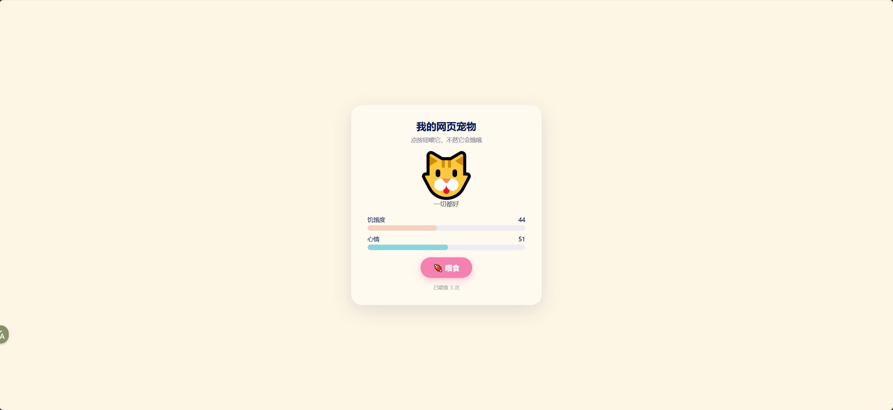

# 网页宠物 (Web Pet) 设计文档



## 1. 项目概述

一个运行在本地 / 局域网的"电子宠物"小应用：浏览器打开网页就能看到一只 emoji 宠物，它会随着时间变饿、心情变化；用户可以点击「喂食」按钮喂它，让它开心起来。

后端是用 C 写的单文件 HTTP 服务器（基于 [Mongoose](https://mongoose.ws/) 嵌入式网络库），前端是单个 HTML 页面（原生 HTML + CSS + JavaScript，无任何依赖）。

### 1.1 目标

- **零依赖运行**：编译后是单个可执行文件 + 一个静态目录，没有 Node、没有 Python，复制即可运行。
- **代码尽可能少**：核心 C 代码 ~115 行，HTML/CSS/JS ~200 行，方便阅读和修改。
- **演示 mongoose 用法**：作为 mongoose HTTP server tutorial 的一个扩展示例，同时展示「静态文件 + REST API」的混合服务模式。

### 1.2 非目标

- 不做账户系统、多宠物、跨用户隔离（全局只有一只宠物，所有访问者看到的是同一只）。
- 不做状态持久化（重启后宠物状态归零）。
- 不做 HTTPS / 鉴权 / 限流。

---

## 2. 技术栈

| 层 | 技术 | 说明 |
|---|---|---|
| HTTP 服务 | [Mongoose v7.21](https://mongoose.ws/) | C 语言嵌入式网络库，单文件 amalgamation (`mongoose.c` + `mongoose.h`) |
| 编程语言 (后端) | C99 | 用 GCC 编译，依赖 libm |
| 前端结构 | HTML5 | 一个 `index.html` |
| 前端样式 | CSS3 | CSS 变量 + `@keyframes` 动画，无预处理器 |
| 前端逻辑 | 原生 JavaScript (ES2017+) | `fetch` + `setInterval`，无框架 |
| 数据格式 | JSON | API 返回 JSON，由 mongoose 的 `mg_http_reply` + `MG_ESC` 拼装 |
| 构建 | GNU Make + GCC | Makefile 一行调用 gcc |
| 运行环境 | Linux (验证于 Ubuntu) | mongoose 跨平台，理论上 macOS / Windows + MinGW 也能跑 |

### 2.1 为什么选 Mongoose

| 需求 | Mongoose 提供的能力 |
|---|---|
| 单进程 HTTP 服务 | `mg_http_listen` 一行就能起 |
| 静态文件托管 | `mg_http_serve_dir` 一行处理 GET 静态资源、MIME、Range |
| 路由匹配 | `mg_match` 支持通配符路径 |
| JSON 响应拼装 | `mg_http_reply` + `%m` 格式符 + `MG_ESC` 自动加引号 / 转义 |
| 跨平台 | 同一份 `mongoose.c` 可在 Linux/macOS/Windows/嵌入式 RTOS 上编译 |
| 无外部依赖 | 不依赖 OpenSSL（除非要 TLS）、libcurl、libevent 等 |

它的代码结构是 **单线程 + 事件循环**，所有连接由一个 `mg_mgr_poll` 循环驱动，类似 Node.js 的 event loop，但运行在 C 层。这意味着我们不用考虑加锁，宠物状态作为一个全局结构体直接读写就行。

---

## 3. 系统架构

```
┌──────────────────┐        HTTP        ┌────────────────────────┐
│   Browser        │◄──────────────────►│   pet (C executable)   │
│  ─────────────   │                    │  ────────────────────  │
│  index.html      │   GET /            │  mongoose event loop   │
│  ├ DOM 状态条     │   ──────────────►  │   │                    │
│  ├ emoji 动画     │   GET /api/pet     │   ├─ static file svc   │
│  └ 轮询定时器     │   POST /api/feed   │   │  (web_root/*)      │
│                  │   ◄─────────────── │   └─ pet API handlers  │
│                  │   JSON {...}       │      ├─ pet_tick()     │
└──────────────────┘                    │      └─ s_pet (state)  │
                                        └────────────────────────┘
```

**两条交互路径：**

1. **首次加载**：浏览器请求 `/` → mongoose 返回 `web_root/index.html`，浏览器渲染页面。
2. **运行时**：JS 每 2 秒 `fetch('/api/pet')` 拉状态；用户点「喂食」时 `fetch('/api/feed', {method:'POST'})`。两者都返回 JSON，前端把数据画到进度条和 emoji 上。

---

## 4. 目录结构

```
tutorials/http/pet/
├── main.c              ← 后端：宠物逻辑 + HTTP 路由
├── Makefile            ← 编译脚本
├── mongoose.c          ← Mongoose 库源码（项目自带，独立可移植）
├── mongoose.h          ← 同上
├── pet                 ← 编译产物：可执行文件（make clean 会删除）
└── web_root/
    └── index.html      ← 前端单页面（HTML + CSS + JS 全部内联）
```

`mongoose.c/h` 是 mongoose 的 amalgamation 单文件版本（把整个库的所有 .c/.h 合并成两个大文件），随项目一起分发，所以这个目录拷到任何地方都能独立编译运行。编译命令：

```bash
gcc main.c mongoose.c -W -Wall -Wextra -O2 -g -I. -o pet -lm
```

---

## 5. 后端设计 (main.c)

### 5.1 数据模型

```c
struct pet {
  double  hunger;        // 0..100，越大越饿
  double  happiness;     // 0..100，越大越开心
  int64_t last_tick_ms;  // 上次推进模拟的时间戳
  int64_t feed_count;    // 累计喂食次数
};

static struct pet s_pet = {30.0, 80.0, 0, 0};
```

- 全局唯一的宠物状态。
- 用 `double` 是为了让数值能平滑变化（积分计算），返回 JSON 时再四舍五入显示。
- `last_tick_ms` 用来算两次更新之间的时间差，无关 wall-clock。

### 5.2 时间推进（懒计算）

宠物状态 **不是定时器驱动**，而是 **事件驱动 + 按需推进**：每次有 HTTP 请求来访问 API，就调一次 `pet_tick()` 把状态从「上次推进时刻」推进到「现在」。

```c
static void pet_tick(void) {
  int64_t now = mg_millis();
  if (s_pet.last_tick_ms == 0) { s_pet.last_tick_ms = now; return; }
  double dt = (now - s_pet.last_tick_ms) / 1000.0;
  s_pet.last_tick_ms = now;

  // 饥饿值线性增长：每 5 秒涨 1
  s_pet.hunger += dt * 0.2;
  if (s_pet.hunger > 100) s_pet.hunger = 100;

  // 心情按指数衰减接近一个目标值
  double target = s_pet.hunger > 70 ? 20 : (s_pet.hunger < 30 ? 90 : 50);
  double k = 0.05;
  s_pet.happiness += (target - s_pet.happiness) * (1 - exp(-k * dt));
  // ...夹紧到 [0, 100]
}
```

**为什么用懒计算？**

- 不需要后台线程或额外定时器，单线程事件循环不会被打扰。
- 即使没人访问，也不会浪费 CPU 推进无意义的状态。
- 一旦有访问，状态就会被推进到当前时刻——用户感受到的是一只「连续在变化」的宠物，但实现上是离散事件。

**心情公式**：用一阶低通滤波模型 `value += (target - value) * (1 - e^(-k*dt))`，效果是心情会平滑地朝目标值靠近，而不是突变。`k = 0.05` 意味着大约 20 秒走完 60% 的差距。

### 5.3 心情判定

```c
static const char *pet_mood(void) {
  if (s_pet.hunger > 80) return "starving";   // 饿坏了
  if (s_pet.hunger > 60) return "hungry";     // 饿
  if (s_pet.happiness > 75) return "happy";   // 开心
  if (s_pet.happiness < 30) return "sad";     // 难过
  return "ok";                                // 普通
}
```

返回字符串作为前端选择 emoji 和文案的 key（前端 `moodMap`）。

### 5.4 HTTP 路由

mongoose 的事件回调是单一函数 `cb`，事件类型 `MG_EV_HTTP_MSG` 表示有完整的 HTTP 请求到达：

```c
static void cb(struct mg_connection *c, int ev, void *ev_data) {
  if (ev != MG_EV_HTTP_MSG) return;
  struct mg_http_message *hm = ev_data;

  if (mg_match(hm->uri, mg_str("/api/pet"), NULL)) {
    pet_tick();
    send_state(c);
  } else if (mg_match(hm->uri, mg_str("/api/feed"), NULL)) {
    pet_tick();
    s_pet.hunger    -= 25; if (s_pet.hunger    < 0)   s_pet.hunger    = 0;
    s_pet.happiness += 10; if (s_pet.happiness > 100) s_pet.happiness = 100;
    s_pet.feed_count++;
    send_state(c);
  } else {
    struct mg_http_serve_opts opts = {0};
    opts.root_dir = "web_root";
    mg_http_serve_dir(c, hm, &opts);
  }
}
```

**路由表（实际行为）：**

| Method | Path        | 说明                          |
|--------|-------------|-------------------------------|
| 任意   | `/api/pet`  | 推进时间，返回当前状态 JSON   |
| 任意   | `/api/feed` | 推进时间 + 喂食一次，返回新状态 |
| GET    | 其它         | 从 `web_root/` 提供静态文件   |

> 注：当前实现没有校验 HTTP method（GET 也能触发 feed）。这是简化做法，生产里应该加 `mg_strcmp(hm->method, mg_str("POST"))` 检查。

### 5.5 JSON 响应

mongoose 提供了带 JSON 转义的格式化输出：

```c
mg_http_reply(c, 200, "Content-Type: application/json\r\n",
              "{%m:%g,%m:%g,%m:%m,%m:%lld}\n",
              MG_ESC("hunger"),     s_pet.hunger,
              MG_ESC("happiness"),  s_pet.happiness,
              MG_ESC("mood"),       MG_ESC(pet_mood()),
              MG_ESC("feed_count"), (int64_t) s_pet.feed_count);
```

格式符约定：
- `%m` 后面跟一个「打印函数 + 数据」对，外面会自动包裹双引号。
- `MG_ESC("xxx")` 是宏，展开成「调用 `mg_print_esc` 来转义字符串」。
- `%g` 浮点（mongoose 自带 `mg_dtoa`，避开 stdio 的 `printf` 在嵌入式环境里的体积）。
- `%lld` 64 位整数。

输出示例：
```json
{"hunger":30,"happiness":80,"mood":"happy","feed_count":0}
```

### 5.6 主循环

```c
mg_mgr_init(&mgr);
mg_http_listen(&mgr, "http://0.0.0.0:8000", cb, NULL);
while (s_signo == 0) mg_mgr_poll(&mgr, 1000);   // 每秒醒一次
mg_mgr_free(&mgr);
```

- `mg_mgr_poll(&mgr, 1000)`：阻塞最多 1 秒；有网络事件就立即返回并触发回调。
- `s_signo` 由 `signal_handler` 设置，Ctrl+C / SIGTERM 时优雅退出。

---

## 6. HTTP API

### 6.1 `GET /api/pet`

**请求**
```
GET /api/pet HTTP/1.1
```

**响应** （200 OK，`application/json`）
```json
{"hunger":42.5,"happiness":68.2,"mood":"ok","feed_count":3}
```

| 字段        | 类型   | 说明                     |
|-------------|--------|--------------------------|
| hunger      | number | 0..100，饥饿程度         |
| happiness   | number | 0..100，心情             |
| mood        | string | starving/hungry/ok/happy/sad |
| feed_count  | number | 启动以来累计喂食次数     |

### 6.2 `POST /api/feed`

**请求**
```
POST /api/feed HTTP/1.1
```

副作用：
- `hunger -= 25`（夹紧 ≥0）
- `happiness += 10`（夹紧 ≤100）
- `feed_count++`

**响应** 同 `/api/pet`，返回喂食后的新状态。

> 当前实现允许 GET 触发；按 REST 语义应限制为 POST，留作改进项。

---

## 7. 前端设计 (web_root/index.html)

### 7.1 页面结构

```
┌─────────────────────────┐
│  我的网页宠物             │
│  点按钮喂它，不然它会饿哦  │
│                         │
│         🐱             │  ← #pet  (96px emoji, idle 动画)
│        一切都好          │  ← #mood (文案)
│                         │
│  饥饿度  ▰▰▱▱▱▱▱▱▱▱  20│  ← 进度条 (颜色随值变化)
│  心情    ▰▰▰▰▰▰▰▰▱▱  85│
│                         │
│      [ 🍖 喂食 ]         │
│      已喂食 3 次          │
└─────────────────────────┘
```

整个页面是一个 `<div class="card">`，居中显示，配色采用柔和奶油黄 + 粉色按钮。

### 7.2 状态映射 (mood → 视觉)

```js
const moodMap = {
  starving: { emoji: '🙀', text: '饿坏了！快喂我！', sad: true },
  hungry:   { emoji: '😿', text: '有点饿了…',         sad: true },
  ok:       { emoji: '🐱', text: '一切都好',           sad: false },
  happy:    { emoji: '😻', text: '心情超棒！',         sad: false },
  sad:      { emoji: '😾', text: '不太开心…',          sad: true },
};
```

`sad: true` 时给 emoji 加 `filter: grayscale(0.4) brightness(0.95)`，视觉上变暗淡。

### 7.3 CSS 动画

| 动画        | 触发      | 实现                                      |
|-------------|-----------|-------------------------------------------|
| `idle`      | 常驻       | `@keyframes` 上下浮动 6px、轻微摇摆 ±2°   |
| `eat`       | 点喂食时   | 0.6s 一次的放大 + 旋转脉冲                |
| `crumbs`    | 点喂食时   | 4 个 🍖 emoji 从宠物中心散落，0.7s 后消失 |
| 进度条切换  | 状态变化时 | `transition: width 0.4s, background-color 0.4s` |

「啃食」效果的关键技巧：每次点击前先 `classList.remove('eating')` + 强制 reflow（`void petEl.offsetWidth`），再加回 class，这样动画能 **重新触发**，否则连续点击只会播一次。

### 7.4 数据流

```
启动:
  refresh() → fetch /api/pet → render(state)
  setInterval(refresh, 2000)              // 每 2s 拉一次

用户点喂食:
  feed()
    ├─ 立即播放 eat 动画 + 撒肉骨头 (乐观 UI)
    ├─ fetch POST /api/feed
    └─ render(state)                       // 用响应数据更新进度条
```

`render()` 是无状态函数：拿到一个 state 对象，把所有 DOM 字段更新一遍。这避免了客户端维护本地副本带来的不一致。

### 7.5 容错

- `fetch` 用 `try/catch` 包裹，失败时静默忽略（页面继续显示上次的状态）。
- 喂食按钮在请求期间 `disabled`，500ms 后恢复，防止连击。
- 没有用 WebSocket 是有意的：HTTP 轮询足够简单，刷新延迟 2s 可接受，宠物变化也慢。

---

## 8. 构建与运行

### 8.1 Makefile

```makefile
PROG ?= pet
SOURCES = main.c mongoose.c
CFLAGS = -W -Wall -Wextra -O2 -g -I.
LDLIBS = -lm

all: $(PROG)
	./$(PROG)

$(PROG): $(SOURCES) mongoose.h
	$(CC) $(SOURCES) $(CFLAGS) -o $(PROG) $(LDLIBS)

clean:
	rm -f $(PROG)

.PHONY: all clean
```

亮点：
- `mongoose.c/h` 直接放在项目目录里，随项目一起分发，目录拷到任何地方都能独立编译。
- `clean` 只删可执行文件，不动源码。
- `-lm` 链接数学库，因为我们用了 `exp()`。

### 8.2 编译并启动

```bash
cd tutorials/http/pet
make           # 编译并启动 (默认 target 会跑 ./pet)
# 或:
make pet
./pet
```

监听 `0.0.0.0:8000`，所有网卡都接受连接。浏览器打开：

```
http://localhost:8000           # 本机
http://192.168.x.x:8000         # 同网段其它设备
```

### 8.3 防火墙提示

Linux 上如果启用了 `ufw`，需要放行：

```bash
sudo ufw allow 8000/tcp
```

虚拟机使用 NAT 模式时，宿主机能访问 192.168.x.x 但其它物理机不行；推荐改桥接模式。

---

## 9. 性能 / 资源占用

| 指标            | 量级                           |
|-----------------|--------------------------------|
| 二进制大小       | ~550 KB（带 -O2 -g）         |
| 内存占用         | <1 MB（mongoose mgr + 一个连接） |
| 单连接吞吐       | 受 mg_mgr_poll 单线程限制，本地几千 QPS 没压力 |
| 状态推进精度     | 受 polling 间隔限制（≥1s），但因为是积分计算，间隔不影响最终结果 |

由于 mongoose 是单线程事件循环：
- 不需要锁。
- 长请求会阻塞其它请求（本项目无长请求，无关紧要）。
- 不适合做 CPU 密集的处理。

---

## 10. 安全性 / 健壮性说明

**当前未做的（已知）：**

- 无任何鉴权，任何能访问端口的人都能喂宠物。
- `/api/feed` 没限制 method 和频率，理论上可以被脚本疯狂调用刷 `feed_count`。
- 没有 CORS 头（同源访问不需要；如要跨源前端需手动加）。
- 没有 TLS（mongoose 支持，但本项目按 HTTP 部署）。
- 静态文件服务器使用 `mg_http_serve_dir`，mongoose 内部已防止 `..` 路径穿越，但仍建议 `web_root` 不要混入敏感文件。

**输入验证**：本项目没有用户输入字段，所以路径穿越和注入面很小。`mg_match` 是精确字符串匹配，不是正则，没有 ReDoS 风险。

---

## 11. 可扩展方向

按工作量从小到大：

1. **限制 method**：用 `mg_strcmp(hm->method, mg_str("POST"))` 让 `/api/feed` 只接受 POST。
2. **状态持久化**：宠物状态 `fwrite` 到 `pet_state.bin`，启动时 `fread` 回来。
3. **增加交互**：陪玩按钮（提升 happiness 但不影响 hunger）、洗澡按钮（解锁 happy 上限）。
4. **多宠物**：根据 cookie 或 URL 参数 `?id=xxx` 维护一个 `map<id, pet>`，每人一只。
5. **WebSocket 推送**：用 mongoose 的 `mg_ws_*` API 做服务端推送，去掉前端轮询。
6. **持久化到 SQLite**：mongoose 不绑定数据库，可以接 SQLite 单文件库。
7. **响应式排行榜**：记录每只宠物的喂食次数、最长存活时间，做个 `/leaderboard`。

---

## 12. 参考链接

- Mongoose 官方网站：https://mongoose.ws/
- Mongoose API 文档：https://mongoose.ws/documentation/
- HTTP server tutorial（本项目脚手架来源）：`tutorials/http/http-server/`
- `MG_ESC` / `%m` 格式说明：见 `mongoose.h` 第 1266 行附近的注释
